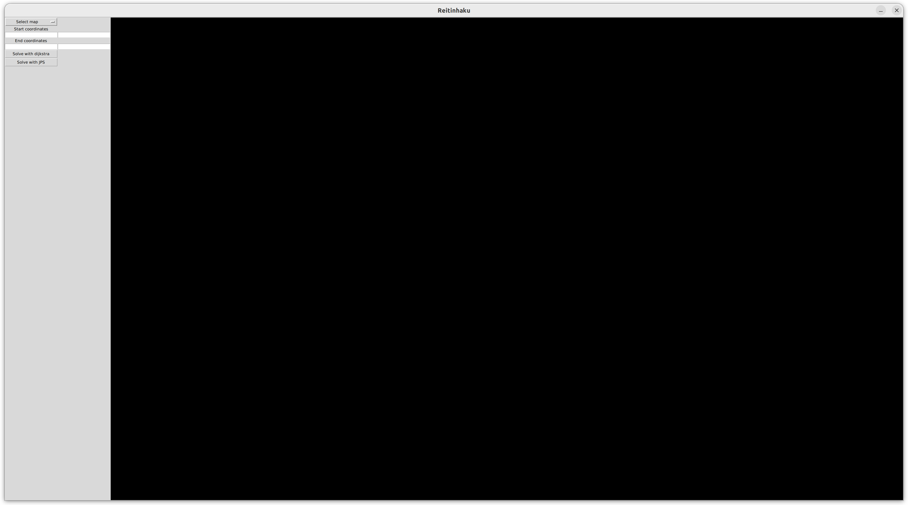
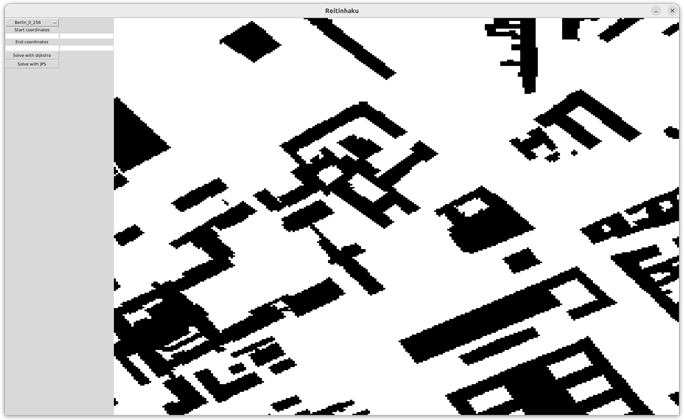
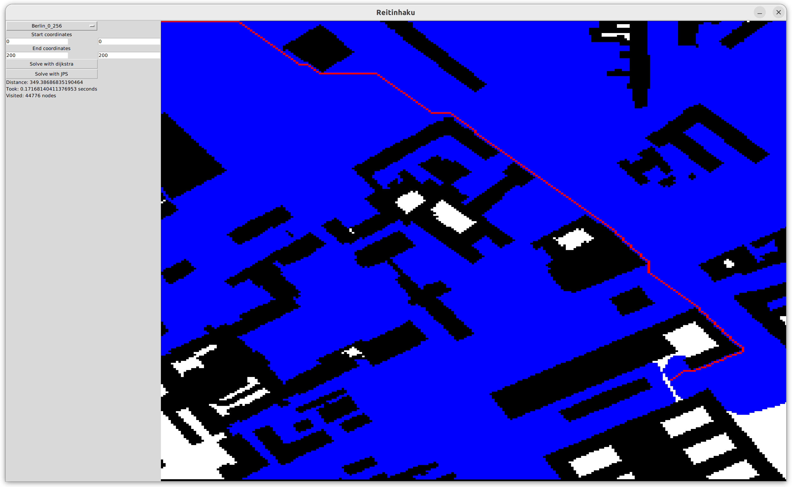

# Käyttöohje
## Ohjelman suorittaminen
Ohjelman riippuvuudet asennetaan seuraavasti:
```bash
poetry install
```
Ohjelma käynnistetään seuraavasti:
```bash
poetry run invoke start 
```
Ohjelman aloitusnäkymä näyttää seuraavalta:

Vasemmalta valitaan kartta ja tämän jälkeen kartta piirtyy ruudulle:

Seuraavaksi valitaan aloitus- ja lopetuskoordinaatit ja valitaan kummalla algoritmilla reitti halutaan selvittää. Jos reitti on olemassa piirtyy algoritmin löytämä reitti punaisella, sekä sinisellä ne ruudut joissa algoritmi on käynyt:

Vasemmalta nähdään myös tietoa, kuten etäisyys ja aika joka algoritmilta kului.